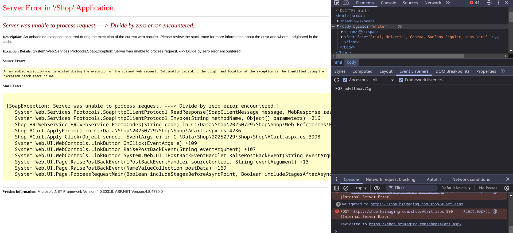

+++
title = 'Blind SQL Injection Vulnerability in HRImaging'
date = 2025-08-03T04:40:54Z
draft = false
+++

# SQL Injection Vulnerability in HRImaging

I didn't do a lot of bug hunting this summer, but while I was on HRImaging for a project of mine, I found a vulnerability that let me inject SQL payloads into the promo code field. For context, HRImaging is a platform and service that takes school pictures, and they have a web interface to preview your images. Since so much of what happened before I found the vulnerability pertains to my project (which should stay private), this blog post isn't that long. For context, HRImaging takes pictures for the yearbook and stuff, and they have a website where you can put in someone's name, ID, and school, and you will be able to order their pictures.

## TL;DR:

I found a blind SQLi in HRImaging's promo code input. By using a payload in this format, `' + (<expression>) + '`, I was able to try a bunch of things, and if I was willing to spend time catching errors and trying payloads, I could try to read data, even though I couldn't directly see what the payload returned (unless it errored).

Also, there's a high possibility I could have ran destructive payloads on the production database, but I never tried it.

## Doxr's Severeness Rating:

End Users affected: One highschool (or at least, my high school, as of writing) is around ~2000 people; I'd estimate at least 20,000+ end users in total would be affected if databases were damaged.

Doxr's Rating: 7.5/10

Why: Because someone could potentially manipulate the database, access or break data, or run dangerous commands on the server and mess up HRImaging's systems.

## How did this happen?

As I am somewhat unfamiliar with ASP.NET (as of writing), I was going through HRImaging's pages, and found interesting things like file paths (for both public files like pictures and server files like `C:\Data\Shop\20250729\Shop\Shop\EncyptionHelper.cs`, which are leaked either by elements in the website or specific errors that you can cause), but while I was in the order page, I saw that I could use a promo code.

## Promo Code SQLi

First, I tried codes like WELCOME and 100OFF because I wanted to get the high-res image links without paying $35, and out of "desperation," I tried a random SQL injection payload, ` ' OR 1=1 -- -` and I actually got an error, specifically:

> Server was unable to process request. ---> Incorrect syntax near '1'.
> Description: An unhandled exception occurred during the execution of the current web request. Please review the stack trace for more information about the error and where it originated in the code.

> Exception Details: System.Web.Services.Protocols.SoapException: Server was unable to process request. ---> Incorrect syntax near '1'.

This actually confirmed that I found an SQLi endpoint that used SOAP, and with my payload, the problem was syntax. After I tried a bunch of other payloads in the promo code field (all erroring, but still confirming that it works), I figured out a pattern I could use: HRImaging seemed to let me test payloads in the format `' + (<expression>) + '`, which behaved the way I wanted to. By crafting payloads in this format, I was able to test SQL expressions through conditional errors, since I couldn't really see what it evaluated to without an error.

I decided to use this payload in my PoC to confirm that the SQLi really existed: `' + CAST(1/0 AS INT) + '`. Running it gives you a divide-by-zero error:

I wanted to push it further without actually testing destructive SQLi payloads, so I ran this to check if I <i>could</i> do RCE: `' + CAST((SELECT 1/0 WHERE (SELECT value_in_use FROM sys.configurations WHERE name = 'xp_cmdshell') = 1) AS INT) + '`

After removing the `maxlength="50"` on the client side for the promo code input (so I could paste longer promocodes/payloads), I saw that it actually went through.

This was actually not a good thing in this case, because the payload tested for `xp_cmdshell`; if I had `xp_cmdshell`, I could achieve RCE on their servers; if I got a divide-by-zero error, that would mean that I had `xp_cmdshell`.

Also, I could have ran something like `' + DB_NAME() + '` but modified it so it errors if I get the right first letter and passes if I got the wrong first letter; that way, I could slowly but surely recode the DB name and read other data without actually having the data returned. However, I ended up stopping here and reporting the vuln.

## Reporting

Like usual, I couldn't find a dedicated report email, so I just emailed both sales@hrimaging.com and myhrimaging@gmail.com (I wasn't sure if sales would redirect nor was I sure if the @gmail.com email was even official, so I CC'd both). There was a web form on the website but I assumed I wouldn't get a response, like what happened with Vivi. 

However, like with Vivi, the report fell on deaf ears. No reply after 2 weeks.

## Conclusion

I feel like more services should have a dedicated/priorized email for security issues like GoGuardian, or at least handle reports to general support like how Lightspeed handled it.

- doxr